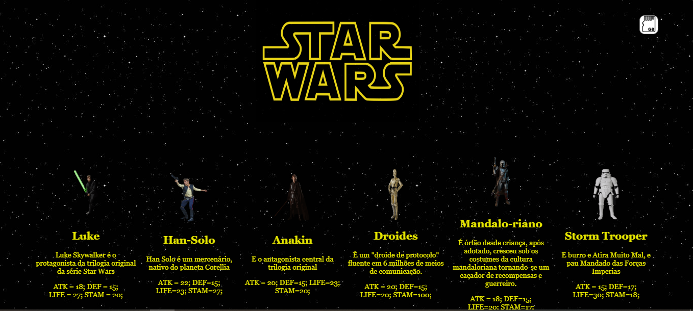

# 🕹️ Star Wars Puzzle Quiz RPG


 
Um jogo de RPG interativo ambientado no universo Star Wars, que combina batalhas por turnos com desafios de perguntas estilo quiz.

## 🎯 Objetivo

Criar uma experiência interativa onde o jogador possa explorar o universo de Star Wars, interagir com personagens icônicos e participar de batalhas em turnos com sistema de pontuação e evolução.

## 🛠 Tecnologias Utilizadas

- *HTML5*: Estrutura da aplicação
- *CSS3*: Estilo e responsividade
- *JavaScript*: Lógica do jogo

## 🎮 Funcionalidades

- Seleção de personagem (Jedi, Sith, Droid, etc)
- Sistema de batalhas em turnos
- Barra de vida, pontos de ataque e defesa
- Evolução por fases ou níveis
- Interface simples e intuitiva
- Sons e efeitos baseados na franquia Star Wars

## 🚀 Como Jogar

1. Clone o repositório:
   ```bash
   git clone https://github.com/beto-rocha-blockchain/StarWars

2. Acesse a pasta do projeto:
   ```bash
    cd star-wars-rpg


3. Abra o arquivo Site_StarWars em seu navegador.


## 👥 Contribuições dos Alunos

Durante o projeto, cada aluno contribuiu com uma parte do sistema, como design de interface, criação de personagens, efeitos de som, lógica de batalha e organização do código. O projeto serviu como uma excelente forma de consolidar os conceitos vistos em aula.

## 📸 Screenshot



## 📄 Licença

Este projeto foi desenvolvido para fins educacionais e está sob a licença MIT.


---

May the Force be with you!
